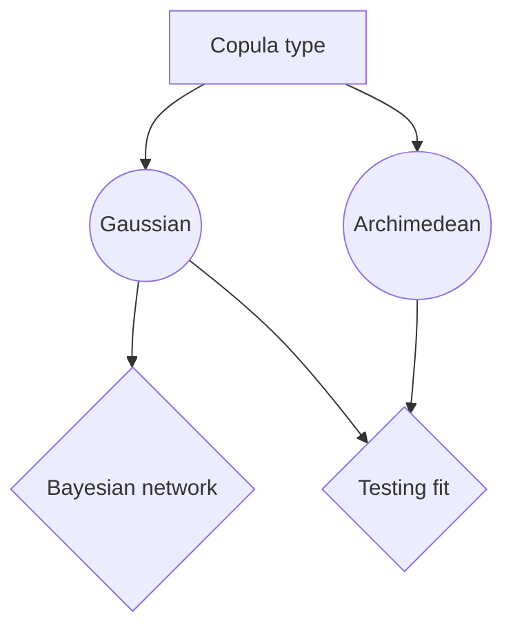

# copulabayesnet

* Load data
* Test Copulas
* Predict from multivariate normal copulas
* Generate several useful plots

## Installation
Install basic

`pip install copulabayesnet`

If you are looking for latest updates, consider installation directly from sources.

```
git clone https://github.com/SjoerdGn/copulabayesnet.git
cd copulabayesnet
python setup.py install
```

## Functionalities


-- make table here


## Gaussian copula

$$c_R^{\text{Ga}}(u)
= \frac{1}{\sqrt{|{R}|}}\exp\left(-\frac{1}{2}
\begin{pmatrix}\Phi^{-1}(u_1)\\ \vdots \\ \Phi^{-1}(u_d)\end{pmatrix}^T \cdot
\left(R^{-1}-I\right) \cdot
\begin{pmatrix}\Phi^{-1}(u_1)\\ \vdots \\ \Phi^{-1}(u_d)\end{pmatrix}
\right),$$


## Diagram

Flow chart


